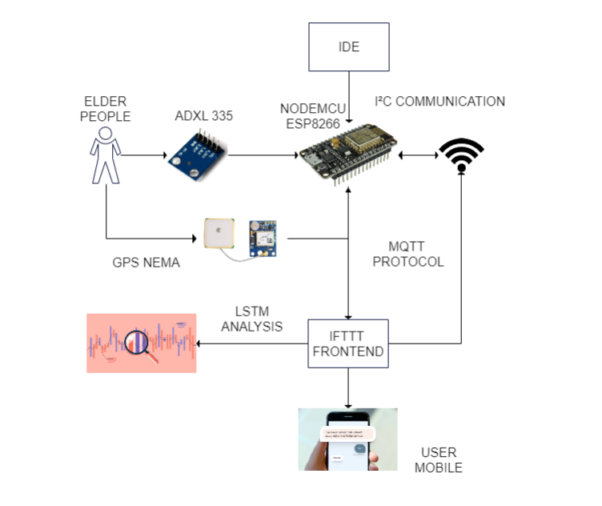
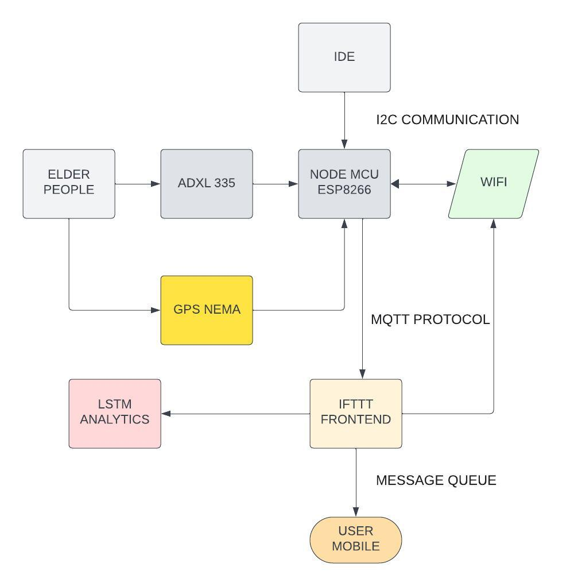
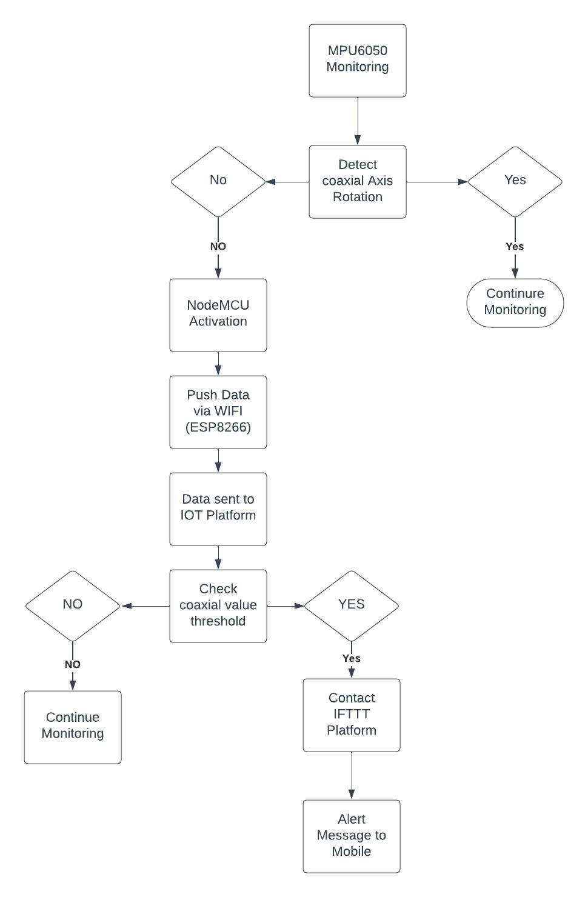
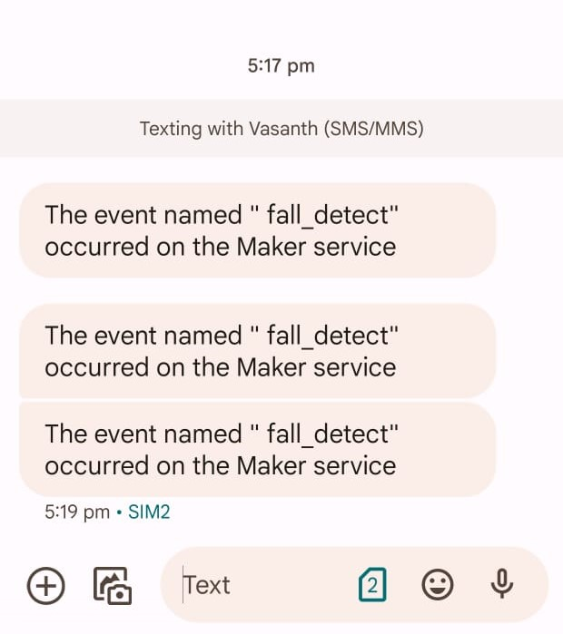
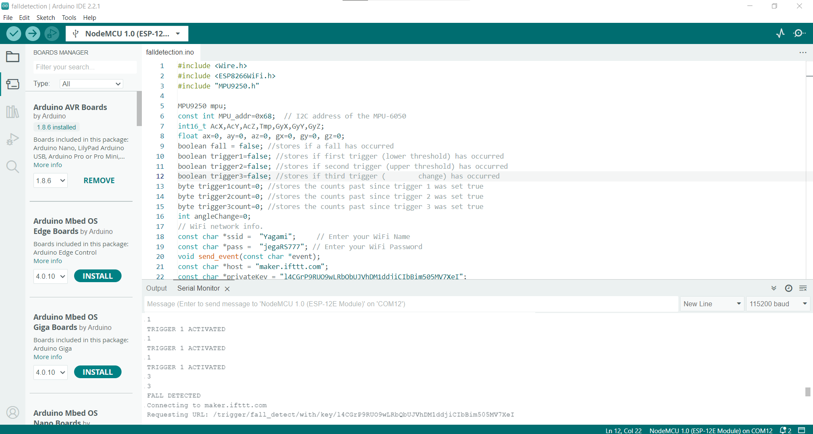

# MINI_PROJECT_FALL_DETECTION

The development of fall detection systems represents a critical endeavor in enhancing elderly care and safety. Despite significant advancements in sensor technology and algorithmic sophistication, several challenges persist, necessitating a comprehensive approach to address multifaceted concerns. The overarching problem is to create a fall detection system that ensures accurate, timely detection across various types of falls while considering user comfort, system reliability, and real-world applicability.

## Features:
#### Multisensory Fall Detection: 
Utilizes accelerometers, gyroscopes, and depth cameras for precise fall detection.

#### Real-time Data Processing: 
Employs machine learning algorithms for immediate analysis of sensor data.

#### Cloud-based Analysis: 
Stores and analyzes extensive sensor data on scalable cloud platforms.

#### Edge Computing Integration: 
Enables local data processing on wearable devices for rapid response.

#### Enhanced Accuracy via Fusion Techniques: 
Integrates sensor fusion for improved detection accuracy.

#### Continual Learning Models: 
Adapts machine learning models based on historical fall patterns.

## Requirements:
### Hardware:
    AUDRINO
    MPU6050
    NODE MCU ESP8266

### Software:
    If This Then That(IFTTT)
    ThinkSpeak(IOT CLOUD)

## Architecture Diagram

## Flow Diagram:

## Installation

### Audrino Installation:
Step 1: Download Audrino

step 2: Under Libraries search for packages:
    1. MPU6050
    2. NODE MCU ESP8266

Step 3: Check for errors and dump the code in the audrino

## Usage
### Real-time Monitoring:

Sensor Activation:

Ensure that all necessary sensors (accelerometers, gyroscopes, depth cameras) are connected and operational.
Grant permissions to access wearable devices or sensors utilized for continuous monitoring.

Fall Detection:

The system initiates real-time monitoring, analyzing sensor data to identify potential falls or irregular movements.
It observes sudden shifts, abnormal trajectories, or impacts that could indicate a fall event.

Alert Triggers:

Upon detecting a fall, the system activates predefined response 

### Mechanisms:
Immediate Alerts: 

Notifies designated emergency contacts through predetermined communication channels (e.g., text messages, emails).

Remote Access: 

Allows remote access for caregivers or healthcare providers to assess the situation and provide assistance.

## SCOPE OF THE PROJECT
The scope of the fall detection project encompasses the comprehensive development and implementation of an advanced system aimed at effectively detecting and responding to various types of falls experienced by the elderly. This project intends to leverage technological advancements in both hardware and software components, integrating innovative sensor technologies, robust algorithms, and real-time communication systems.

Firstly, the project scope involves designing and integrating diverse sensor hardware components such as accelerometers, gyroscopes, pressure sensors, and GPS trackers. These components play a crucial role in monitoring and collecting multidimensional motion data, context-specific information, and real-time location data, ensuring a comprehensive understanding of the user's movements and precise identification of potential fall incidents, particularly in both indoor and outdoor environments.

Secondly, the software components of this project encompass the development and implementation of sophisticated data processing algorithms and machine learning models. These algorithms will accurately identify patterns indicative of falls while distinguishing them from normal activities. Leveraging machine learning methods, such as neural networks and decision trees, alongside sensor fusion techniques, will significantly improve the system's accuracy and reduce false positives and negatives.
Moreover, the project aims to deploy cloud-based storage and analysis solutions for scalability, enabling the system to accommodate extensive sensor data from multiple users. This will facilitate advanced analysis, continuous learning, and refinement of machine learning models based on historical data, thereby enhancing prediction accuracy and system adaptability over time.

Additionally, the project scope extends to using edge computing techniques, enabling local data processing on wearable devices to ensure rapid response and minimize dependence on continuous internet connectivity. This aspect aims to address challenges related to latency and enhance the reliability and real-time responsiveness of the system in diverse real-world scenarios.

Furthermore, the scope involves the exploration of innovative methodologies, such as anomaly detection algorithms and context-aware modeling, to strike a balance between sensitivity and specificity, thereby improving the reliability and accuracy of fall detection systems.

Overall, the scope of this project encompasses the holistic development of a sophisticated fall detection system, integrating cutting-edge hardware components, advanced software algorithms, and innovative methodologies to create a robust, reliable, and user-friendly solution for enhancing the safety and well-being of the elderly population.

## PROPOSED SYSTEM
The proposed system for this project aims to harness state-of-the-art technological advancements in fall detection, leveraging a combination of hardware and software components to create an innovative and efficient solution for addressing the diverse challenges associated with detecting falls among the elderly. The system envisions the utilization of advanced sensor technologies, including sophisticated accelerometers, gyroscopes, pressure sensors, and GPS trackers, integrated into wearable devices such as smartwatches and pendants. These sensors will continuously monitor and analyze multidimensional motion data, contextual information, and real-time location data, providing a comprehensive understanding of the user's movements and enabling accurate fall detection both indoors and outdoors.

Moreover, the proposed system focuses on the development and implementation of cutting-edge software components. This includes the integration of robust data processing algorithms and machine learning models that excel in accurately identifying fall patterns while effectively distinguishing them from routine activities. Machine learning methods such as neural networks, recurrent neural networks, and decision trees will be employed to enhance the system's adaptability and accuracy, ensuring minimal false positives and negatives.

Furthermore, the proposed system emphasizes the use of cloud-based storage and analysis solutions to facilitate scalability and accommodate extensive sensor data. This approach will enable continuous learning and refinement of machine learning models based on historical data, thereby improving prediction accuracy and system reliability. Additionally, the system will utilize edge computing methodologies to process data locally on devices, ensuring rapid response times and reducing dependency on constant internet connectivity.

Additionally, the proposed system will explore innovative fusion techniques for sensor data and machine learning models to enhance accuracy and real-time responsiveness. Anomaly detection algorithms and context-aware modeling will be integrated to strike an optimal balance between sensitivity and specificity, further improving the reliability of fall detection systems.

Overall, the proposed system aims to integrate cutting-edge hardware components with sophisticated software algorithms and innovative methodologies to develop a robust, reliable, and user-friendly fall detection system. This system is designed to significantly improve the safety and well-being of the elderly by accurately detecting falls and enabling timely interventions in diverse real-world scenarios

## Implementation:

## Output:

## Result:

The  Fall Detection System emphasizes the system's ability to swiftly identify fall events, trigger immediate response mechanisms, collaborate for prompt assistance, and continually improve its functionalities based on real-world usage and feedback.
