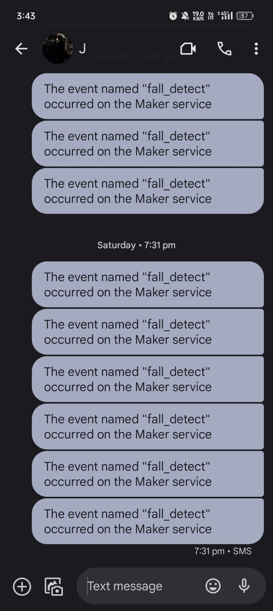

# MINI_PROJECT_FALL_DETECTION

The development of fall detection systems represents a critical endeavor in enhancing elderly care and safety. Despite significant advancements in sensor technology and algorithmic sophistication, several challenges persist, necessitating a comprehensive approach to address multifaceted concerns. The overarching problem is to create a fall detection system that ensures accurate, timely detection across various types of falls while considering user comfort, system reliability, and real-world applicability.

## Features:
#### Multisensory Fall Detection: 
Utilizes accelerometers, gyroscopes, and depth cameras for precise fall detection.

#### Real-time Data Processing: 
Employs machine learning algorithms for immediate analysis of sensor data.

#### Cloud-based Analysis: 
Stores and analyzes extensive sensor data on scalable cloud platforms.

#### Edge Computing Integration: 
Enables local data processing on wearable devices for rapid response.

#### Enhanced Accuracy via Fusion Techniques: 
Integrates sensor fusion for improved detection accuracy.

#### Continual Learning Models: 
Adapts machine learning models based on historical fall patterns.


## Requirements:
### Hardware:
    AUDRINO
    MPU6050
    NODE MCU ESP8266

### Software:
    If This Then That(IFTTT)
    ThinkSpeak(IOT CLOUD)

## Architecture Diagram

## Flow Diagram:


## Installation

### Audrino Installation:
Step 1: Download Audrino

step 2: Under Libraries search for packages:
    1. MPU6050
    2. NODE MCU ESP8266

Step 3: Check for errors and dump the code in the audrino

## Usage
### Real-time Monitoring:

Sensor Activation:

Ensure that all necessary sensors (accelerometers, gyroscopes, depth cameras) are connected and operational.
Grant permissions to access wearable devices or sensors utilized for continuous monitoring.

Fall Detection:

The system initiates real-time monitoring, analyzing sensor data to identify potential falls or irregular movements.
It observes sudden shifts, abnormal trajectories, or impacts that could indicate a fall event.

Alert Triggers:

Upon detecting a fall, the system activates predefined response 

### Mechanisms:
Immediate Alerts: 

Notifies designated emergency contacts through predetermined communication channels (e.g., text messages, emails).

Remote Access: 

Allows remote access for caregivers or healthcare providers to assess the situation and provide assistance.


## Program:
### FALL DETECTION:
```
#include <Wire.h>
#include <ESP8266WiFi.h>
#include "MPU9250.h"

MPU9250 mpu;
const int MPU_addr=0x68;  // I2C address of the MPU-6050
int16_t AcX,AcY,AcZ,Tmp,GyX,GyY,GyZ;
float ax=0, ay=0, az=0, gx=0, gy=0, gz=0;
boolean fall = false; //stores if a fall has occurred
boolean trigger1=false; //stores if first trigger (lower threshold) has occurred
boolean trigger2=false; //stores if second trigger (upper threshold) has occurred
boolean trigger3=false; //stores if third trigger (orientation change) has occurred
byte trigger1count=0; //stores the counts past since trigger 1 was set true
byte trigger2count=0; //stores the counts past since trigger 2 was set true
byte trigger3count=0; //stores the counts past since trigger 3 was set true
int angleChange=0;
// WiFi network info.
const char *ssid =  "Yagami";     // Enter your WiFi Name
const char *pass =  "jegaRS777"; // Enter your WiFi Password
void send_event(const char *event);
const char *host = "maker.ifttt.com";
const char *privateKey = "l4CGrP9RUO9wLRbQbUJVhDM1ddjiCIbBim505MV7XeI";
void setup(){
 Serial.begin(115200);
 Wire.begin();
 Wire.beginTransmission(MPU_addr);
 Wire.write(0x6B);  // PWR_MGMT_1 register
 Wire.write(0);     // set to zero (wakes up the MPU-6050)
 Wire.endTransmission(true);
 Serial.println("Wrote to IMU");
  Serial.println("Connecting to ");
  Serial.println(ssid);
  WiFi.begin(ssid, pass);
  while (WiFi.status() != WL_CONNECTED)
  {
    delay(500);
    Serial.print(".");              // print ... till not connected
  }
  Serial.println("");
  Serial.println("WiFi connected");
 }
void loop(){
 mpu_read();
 ax = (AcX-2050)/16384.00;
 ay = (AcY-77)/16384.00;
 az = (AcZ-1947)/16384.00;
 gx = (GyX+270)/131.07;
 gy = (GyY-351)/131.07;
 gz = (GyZ+136)/131.07;
 // calculating Amplitute vactor for 3 axis
 float Raw_Amp = pow(pow(ax,2)+pow(ay,2)+pow(az,2),0.5);
 int Amp = Raw_Amp * 10;  // Mulitiplied by 10 bcz values are between 0 to 1
 Serial.println(Amp);
 if (Amp<=2 && trigger2==false){ //if AM breaks lower threshold (0.4g)
   trigger1=true;
   Serial.println("TRIGGER 1 ACTIVATED");
   }
 if (trigger1==true){
   trigger1count++;
   if (Amp>=12){ //if AM breaks upper threshold (3g)
     trigger2=true;
     Serial.println("TRIGGER 2 ACTIVATED");
     trigger1=false; trigger1count=0;
     }
 }
 if (trigger2==true){
   trigger2count++;
   angleChange = pow(pow(gx,2)+pow(gy,2)+pow(gz,2),0.5); Serial.println(angleChange);
   if (angleChange>=30 && angleChange<=400){ //if orientation changes by between 80-100 degrees
     trigger3=true; trigger2=false; trigger2count=0;
     Serial.println(angleChange);
     Serial.println("TRIGGER 3 ACTIVATED");
       }
   }
 if (trigger3==true){
    trigger3count++;
    if (trigger3count>=10){ 
       angleChange = pow(pow(gx,2)+pow(gy,2)+pow(gz,2),0.5);
       //delay(10);
       Serial.println(angleChange); 
       if ((angleChange>=0) && (angleChange<=10)){ //if orientation changes remains between 0-10 degrees
           fall=true; trigger3=false; trigger3count=0;
           Serial.println(angleChange);
             }
       else{ //user regained normal orientation
          trigger3=false; trigger3count=0;
          Serial.println("TRIGGER 3 DEACTIVATED");
       }
     }
  }
 if (fall==true){ //in event of a fall detection
   Serial.println("FALL DETECTED");
   send_event("fall_detect"); 
   fall=false;
   }
 if (trigger2count>=6){ //allow 0.5s for orientation change
   trigger2=false; trigger2count=0;
   Serial.println("TRIGGER 2 DECACTIVATED");
   }
 if (trigger1count>=6){ //allow 0.5s for AM to break upper threshold
   trigger1=false; trigger1count=0;
   Serial.println("TRIGGER 1 DECACTIVATED");
   }
  delay(100);
   }
void mpu_read(){
 Wire.beginTransmission(MPU_addr);
 Wire.write(0x3B);  // starting with register 0x3B (ACCEL_XOUT_H)
 Wire.endTransmission(false);
 Wire.requestFrom(MPU_addr,14,true);  // request a total of 14 registers
 AcX=Wire.read()<<8|Wire.read();  // 0x3B (ACCEL_XOUT_H) & 0x3C (ACCEL_XOUT_L)    
 AcY=Wire.read()<<8|Wire.read();  // 0x3D (ACCEL_YOUT_H) & 0x3E (ACCEL_YOUT_L)
 AcZ=Wire.read()<<8|Wire.read();  // 0x3F (ACCEL_ZOUT_H) & 0x40 (ACCEL_ZOUT_L)
 Tmp=Wire.read()<<8|Wire.read();  // 0x41 (TEMP_OUT_H) & 0x42 (TEMP_OUT_L)
 GyX=Wire.read()<<8|Wire.read();  // 0x43 (GYRO_XOUT_H) & 0x44 (GYRO_XOUT_L)
 GyY=Wire.read()<<8|Wire.read();  // 0x45 (GYRO_YOUT_H) & 0x46 (GYRO_YOUT_L)
 GyZ=Wire.read()<<8|Wire.read();  // 0x47 (GYRO_ZOUT_H) & 0x48 (GYRO_ZOUT_L)
 }
void send_event(const char *event)
{
  Serial.print("Connecting to "); 
  Serial.println(host);
    // Use WiFiClient class to create TCP connections
  WiFiClient client;
  const int httpPort = 80;
  if (!client.connect(host, httpPort)) {
    Serial.println("Connection failed");
    return;
  }
    // We now create a URI for the request
  String url = "/trigger/";
  url += event;
  url += "/with/key/";
  url += privateKey;
  Serial.print("Requesting URL: ");
  Serial.println(url);
  // This will send the request to the server
  client.print(String("GET ") + url + " HTTP/1.1\r\n" +
               "Host: " + host + "\r\n" + 
               "Connection: close\r\n\r\n");
  while(client.connected())
  {
    if(client.available())
    {
      String line = client.readStringUntil('\r');
      Serial.print(line);
    } else {
      // No data yet, wait a bit
      delay(50);
    };
  }
  Serial.println();
  Serial.println("closing connection");
  client.stop();
}

```
LSTM:
```
from tensorflow.keras.models import Sequential
from tensorflow.keras.layers import LSTM, Dense

model = Sequential()
model.add(LSTM(units=50, input_shape=(X_train.shape[1], X_train.shape[2]), return_sequences=True))
model.add(LSTM(units=50, return_sequences=True))
model.add(LSTM(units=50))
model.add(Dense(units=1, activation='sigmoid'))

model.compile(optimizer='adam', loss='binary_crossentropy', metrics=['accuracy'])
model.fit(X_train, y_train, epochs=10, batch_size=32, validation_split=0.2)

```

## Output:


## Result:

The  Fall Detection System emphasizes the system's ability to swiftly identify fall events, trigger immediate response mechanisms, collaborate for prompt assistance, and continually improve its functionalities based on real-world usage and feedback.
